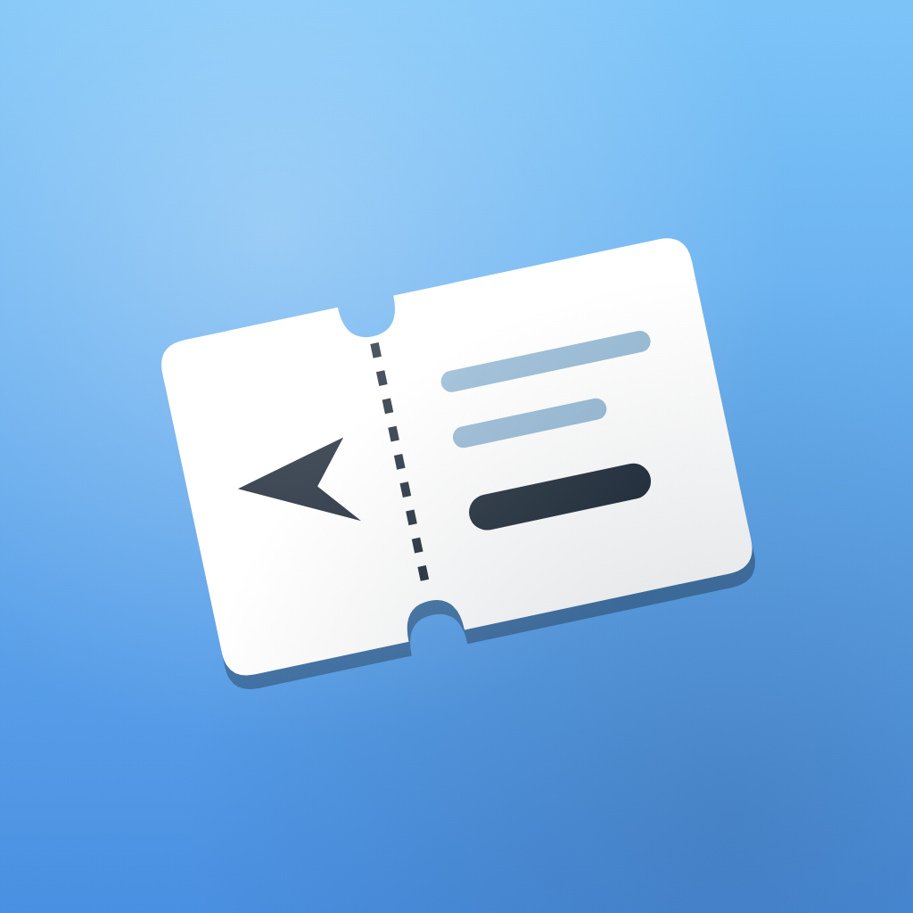

# Tripy

> **여행지 환율을 가장 쉽게.** 현지 통화로 누른 금액을 그대로 KRW로 보여주는 iOS 환율 계산기.

  

---

## Tripy가 해결하는 것

여행지 환전소 앞에서, 면세점 계산대에서, 호텔 미니바 메뉴를 보면서.
환율 계산기 앱을 켜고 — 통화 코드를 찾고 — 다시 계산기로 돌아가는 그 과정 자체가 피곤합니다.

**Tripy는 그 흐름을 하나로 묶습니다.**
계산기에서 숫자를 누르는 동안, 결과는 이미 원화로 보입니다.

---

## 주요 기능

### 익숙한 계산기, 그대로
iOS 기본 계산기와 동일한 키 배치·동작 규칙. AC/C 토글, `=` 반복 동작, 연속 연산까지 정확히 따라갑니다. 새 앱을 배우는 비용 없이 바로 사용하세요.

### 실시간 환율 변환
[open.er-api.com](https://open.er-api.com) 기반 24시간 갱신.
숫자를 입력하는 동시에 KRW 환산 결과가 표시됩니다.

### 위치 기반 자동 통화 선택
현재 위치를 기반으로 여행지 통화를 자동으로 골라줍니다.
공항 도착 직후, 첫 결제 직전 — 통화 검색 한 단계를 건너뜁니다.

### 빠른 통화 검색·필터
국가명·통화코드 검색으로 원하는 통화를 즉시 선택. 자주 쓰는 통화는 상단에 자동 정렬.

### 오프라인에서도 동작
마지막 환율을 캐시해두기 때문에 비행기 모드나 로밍 사각지대에서도 계산이 가능합니다.

### VoiceOver 친화
키패드 17개 버튼, 환율 영역, 통화 선택 — 핵심 UI 전체에 한국어 VoiceOver 라벨을 적용했습니다.

---

## 디자인

| 요소 | 값 |
|------|------|
| 브랜드 컬러 (Light) | `#5BA8EC` |
| 브랜드 컬러 (Dark) | `#1E2A38` |
| 타이포 (헤드라인) | Black Han Sans |
| 타이포 (본문) | Pretendard |
| 워드마크 | Space Grotesk |

Light / Dark 모드 모두 정식 지원, iPhone portrait 전용.

---

## Tech

Swift 6.0 · SwiftUI · MVI (Model-View-Intent) · `@Observable` · iOS 18.0+

---

## 다운로드

> App Store 출시 준비 중. 출시되면 본 섹션에 링크가 추가됩니다.

---

## 개발 기록

이 레포는 **Claude Code(Opus 4.7)와의 바이브 코딩 실험**으로 만들어졌습니다.
마일스톤 진행, Multi-AI 오케스트레이션, Figma 워크플로우 등 개발 과정 상세는 별도 문서로 정리되어 있습니다.

→ [`docs/development.md`](docs/development.md)
